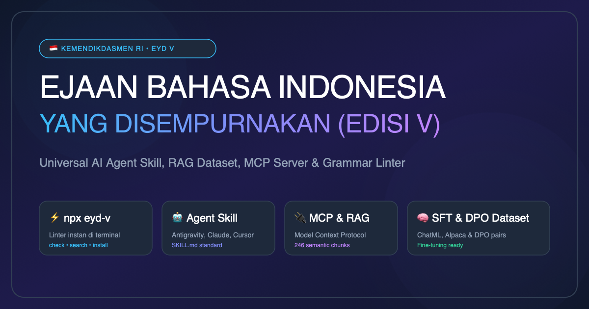

<p align="center">
  
</p>

<p align="center">
  
</p>

<h1 align="center">EJAAN BAHASA INDONESIA YANG DISEMPURNAKAN (EYD V)</h1>

<p align="center">
  <strong>Universal AI Agent Skill, Dataset Terstruktur & Linter Ekosistem Berbasis EYD Edisi Kelima</strong>
</p>

<p align="center">
  <a href="https://www.npmjs.com/package/eyd-v"></a>
  <a href="https://ejaan.kemendikdasmen.go.id/"></a>
  <a href="https://ejaan.kemendikdasmen.go.id/"></a>
  <a href="https://modelcontextprotocol.io/"></a>
  
  <a href="https://donate.ppti.me/"></a>
  <a href="LICENSE"></a>
  
</p>

---

## 📢 Pernyataan Keterbukaan Informasi & Penafian (Disclaimer)

> [!NOTE]
> **Status Repositori**:
> Repositori ini merupakan **proyek independen / komunitas open-source dan BUKAN repositori resmi** yang dikelola langsung oleh Badan Pengembangan dan Pembinaan Bahasa maupun Kementerian Pendidikan Dasar dan Menengah Republik Indonesia (Kemendikdasmen RI).
>
> **Sumber Data & Keterbukaan Informasi**:
> Seluruh kaidah kebahasaan, teks pasal, butir aturan, serta contoh kalimat yang ada di repositori ini disarikan secara akurat dan transparan langsung dari sumber publik resmi pemerintah:
> 1. Laman Resmi Pedoman Ejaan Bahasa Indonesia: [https://ejaan.kemendikdasmen.go.id/](https://ejaan.kemendikdasmen.go.id/)
> 2. Keputusan Kepala Badan Pengembangan dan Pembinaan Bahasa Kemendikbudristek RI Nomor **0424/I/BS.00.01/2022** tentang *Pedoman Umum Ejaan Bahasa Indonesia yang Disempurnakan (EYD Edisi Kelima)*.
> 3. Kamus Besar Bahasa Indonesia (KBBI VI Daring) untuk rujukan kosakata dan leksikon baku.
>
> **Tujuan Proyek**:
> Repositori ini dikembangkan semata-mata untuk kepentingan **edukasi, keterbukaan informasi publik, standardisasi kecerdasan buatan (AI Agents), dan kemudahan akses masyarakat luas** terhadap pedoman berbahasa Indonesia yang baik dan benar. Logo *Tut Wuri Handayani* disertakan sebagai bentuk atribusi identitas sumber pedoman pendidikan Republik Indonesia.

---

## 📑 Daftar Isi

- [📢 Pernyataan Keterbukaan Informasi & Penafian](#-pernyataan-keterbukaan-informasi--penafian-disclaimer)
- [🌟 Keunggulan Utama](#-keunggulan-utama)
- [🚀 Penggunaan Instan via NPX](#-penggunaan-instan-via-npx)
  - [1. Memeriksa Teks atau Berkas Dokumen (Linter)](#1-memeriksa-teks-atau-berkas-dokumen-linter)
  - [2. Mencari Kaidah & Pasal Resmi](#2-mencari-kaidah--pasal-resmi)
  - [3. Memasang Skill ke AI Agents (Installer)](#3-memasang-skill-ke-ai-agents-installer)
  - [4. Menjalankan MCP Server (Model Context Protocol)](#4-menjalankan-mcp-server-model-context-protocol)
- [🌐 Web Playground Interaktif](#-web-playground-interaktif)
- [💻 Penggunaan Programmatic (Node.js & TypeScript SDK)](#-penggunaan-programmatic-nodejs--typescript-sdk)
- [🧠 AI Learning, Fine-Tuning & RAG Hub](#-ai-learning-fine-tuning--rag-hub)
  - [1. Fine-Tuning & Alignment (SFT & DPO)](#1-fine-tuning--alignment-sft--dpo)
  - [2. Ingestion RAG ke Vector Database](#2-ingestion-rag-ke-vector-database)
  - [3. Menjalankan Model Lokal dengan Ollama](#3-menjalankan-model-lokal-dengan-ollama)
  - [4. Skema Function Calling / Tool Definitions](#4-skema-function-calling--tool-definitions)
- [📂 Struktur Repositori & Pengetahuan](#-struktur-repositori--pengetahuan)
- [🧪 Evaluasi & Pengujian](#-evaluasi--pengujian)
- [💖 Dukungan & Donasi](#-dukungan--donasi)
- [🤝 Komunitas, Kontribusi & Tata Kelola](#-komunitas-kontribusi--tata-kelola)
- [📄 Lisensi & Hak Cipta](#-lisensi--hak-cipta)

## 🌟 Keunggulan Utama

* 🏛️ **100% Selaras Pedoman Resmi**: Mencakup seluruh 38 menu tampilan dan 4 Bab utama (Penggunaan Huruf, Penulisan Kata, Penggunaan Tanda Baca, Penulisan Unsur Serapan), SK Penetapan resmi, serta Kata Pengantar.
* 🤖 **Universal Agent Skill (`SKILL.md`)**: Siap dipasang ke Google Antigravity, Claude Code, Cursor IDE, Windsurf, Copilot, dan agen AI lainnya hanya dengan satu perintah CLI.
* 🧠 **AI Learning & Fine-Tuning Ready**: Dilengkapi dataset Supervised Fine-Tuning (SFT ChatML & Alpaca) serta pasangan **DPO (Direct Preference Optimization)** agar model bahasa Indonesia tidak berhalusinasi atau menghasilkan ejaan nonbaku.
* ⚡ **Model Context Protocol (MCP Server)**: Dilengkapi server MCP bawaan (`npx eyd-v mcp`) agar agen dapat menelusuri aturan dan memeriksa ejaan secara dinamis via tool-call.
* 📚 **RAG-Ready Vector Chunks**: Format `data/eyd-v-chunks.jsonl` (246 semantis chunks) dan contoh ingestion skrip Python/Node.js siap diindeks ke Pinecone, Chroma, Qdrant, Cloudflare Vectorize, atau pgvector.
* 🦙 **Ollama Modelfile**: Berkas `prompts/Modelfile` siap pakai untuk menjalankan model spesialis EYD V lokal dengan satu perintah (`ollama create eyd-v -f prompts/Modelfile`).
* 🔎 **CLI & Linter Cepat**: Alat pemeriksa ejaan di terminal (`npx eyd-v check`) untuk mendeteksi kesalahan umum (preposisi, partikel *pun*, bentuk terikat, peluluhan KTSP, tanda koma, dan kata nonbaku).
* 📖 **Leksikon Kata Baku & Morfologi KTSP**: Kamus kata baku vs nonbaku populer serta panduan peluluhan fonem K, T, S, P yang sering membingungkan LLM.

---

## 🚀 Penggunaan Instan via NPX

Tidak perlu instalasi rumit, cukup jalankan perintah berikut di terminal Anda:

### 1. Memeriksa Teks atau Berkas Dokumen (Linter)
```bash
# Periksa kalimat langsung
npx eyd-v check "Dimana kamu kuliah pasca sarjana?"

# Periksa berkas Markdown / Teks
npx eyd-v check README.md
```

**Contoh Hasil Pemeriksaan:**
```text
⚠️ Ditemukan 2 potensi ketidaksesuaian EYD V:

1. [PREPOSISI] "Dimana" ➔ "Di mana"
   Kaidah : Kata Depan 'di' menyatakan tempat ditulis terpisah
   Rujukan: https://ejaan.kemendikdasmen.go.id/eyd/penulisan-kata/kata-depan/#1

2. [BENTUK_TERIKAT] "pasca sarjana" ➔ "pascasarjana"
   Kaidah : Bentuk terikat 'pasca-' ditulis serangkai
   Rujukan: https://ejaan.kemendikdasmen.go.id/eyd/penulisan-kata/kata-turunan/#bentuk-terikat

Rekomendasi Teks Bersih:
Di mana kamu kuliah pascasarjana?
```

### 2. Mencari Kaidah & Pasal Resmi
```bash
npx eyd-v search "tanda koma konjungsi"
npx eyd-v search "huruf kapital jabatan"
npx eyd-v search "bentuk terikat"
```

### 3. Memasang Skill ke AI Agents (Installer)
```bash
# Pasang ke semua agen yang terdeteksi di sistem/proyek:
npx eyd-v install --all

# Atau pasang spesifik:
npx eyd-v install --antigravity   # Pasang ke ~/.gemini/config/skills/eyd-v/
npx eyd-v install --cursor        # Pasang ke .cursor/rules/eyd-v.mdc
npx eyd-v install --claude        # Pasang ke .claude/skills/eyd-v/
npx eyd-v install --target ./my-agent-folder
```

### 4. Menjalankan MCP Server (Model Context Protocol)
Untuk menghubungkan Claude Desktop, Cursor, atau Windsurf:
```bash
npx eyd-v mcp
```

**Konfigurasi `claude_desktop_config.json`:**
```json
{
  "mcpServers": {
    "eyd-v": {
      "command": "npx",
      "args": ["-y", "eyd-v", "mcp"]
    }
  }
}
```

---

## 🌐 Web Playground Interaktif

Ingin mencoba dan menguji linter EYD V tanpa membuka terminal atau menginstal paket apa pun? Repositori ini telah dilengkapi aplikasi **Web Playground mandiri** di [`demo/index.html`](demo/index.html):

* 🖥️ **Buka Langsung di Browser**: Cukup buka berkas `demo/index.html` dengan peramban favorit Anda (Chrome, Safari, Firefox, Edge).
* ✍️ **Deteksi Kesalahan Realtime**: Memeriksa teks naskah dan menampilkan perbaikan secara visual dengan penyorotan warna.
* 📋 **Salin Teks Bersih 1-Klik**: Tombol salin instan untuk memindahkan teks yang sudah diperbaiki ke aplikasi kerja Anda.
* ☁️ **Siap GitHub Pages**: Dapat langsung diaktifkan sebagai live demo berbasis web gratis.

---

## 💻 Penggunaan Programmatic (Node.js & TypeScript SDK)

Anda dapat mengimpor fungsi-fungsi EYD V langsung ke dalam aplikasi backend, bot, atau pipeline LLM Anda:

```bash
npm install eyd-v
```

```javascript
const { checkEyd, searchRules, getRuleById } = require('eyd-v');

// 1. Memeriksa Teks
const result = checkEyd("Kita harus merubah sistem analisa ini.");
console.log(result.valid); // false
console.log(result.errorCount); // 2
console.log(result.correctedText); // "Kita harus mengubah sistem analisis ini."
console.log(result.errors);
/*
[
  {
    type: 'PELULUHAN_KTSP',
    original: 'merubah',
    suggestion: 'mengubah',
    rule: "Kata dasar 'ubah' mendapat awalan meN- menjadi 'mengubah'"
  },
  {
    type: 'KOSAKATA_NONBAKU',
    original: 'analisa',
    suggestion: 'analisis',
    rule: "Kata baku adalah 'analisis' (bukan 'analisa')"
  }
]
*/

// 2. Mencari Aturan
const rules = searchRules("tanda titik dua", { limit: 3 });
console.log(rules[0].title); // "1. Tanda titik dua digunakan..."

// 3. Mengambil Detail Pasal
const rule = getRuleById("tanda-titik#1");
console.log(rule.content);
```

---

## 🧠 AI Learning, Fine-Tuning & RAG Hub

Repositori ini secara khusus dilengkapi modul dataset siap pakai untuk berbagai kebutuhan pelatihan dan inferensi AI:

### 1. Fine-Tuning & Alignment (SFT & DPO)
Terletak di direktori [`data/ai-learning/`](file:///Users/ardianryan/Documents/eyd-v-skill/data/ai-learning/):
* **`instruction-tuning-chatml.jsonl` (321 baris)**: Format pesan multi-turn (`system`, `user`, `assistant`) untuk supervised fine-tuning model OpenAI, Qwen, Llama, Mistral, dll.
* **`alpaca-instructions.json` (271 entri)**: Format Alpaca standar (`instruction`, `input`, `output`).
* **`dpo-preference.jsonl` (75 pasang)**: Dataset *Direct Preference Optimization* berisi pasangan jawaban baku (*chosen*) vs jawaban salah/halusinasi (*rejected*) untuk melatih model agar menghindari kesalahan ejaan fatal (*dimana*, *pasca sarjana*, *merubah*, dll.).
* **`qa-evaluation.jsonl` (246 pasang)**: Dataset evaluasi ground-truth untuk menguji akurasi retrieval RAG.

### 2. Ingestion RAG ke Vector Database
Skrip contoh siap pakai untuk memuat 246 potongan semantis EYD V:
* **Python (ChromaDB / LangChain)**: [`scripts/rag/ingest-chroma.py`](file:///Users/ardianryan/Documents/eyd-v-skill/scripts/rag/ingest-chroma.py)
* **Node.js (Vectorize / Pinecone)**: [`scripts/rag/ingest-node.js`](file:///Users/ardianryan/Documents/eyd-v-skill/scripts/rag/ingest-node.js)

### 3. Menjalankan Model Lokal dengan Ollama
Jalankan model lokal yang mahir kaidah EYD V menggunakan berkas [`prompts/Modelfile`](file:///Users/ardianryan/Documents/eyd-v-skill/prompts/Modelfile):
```bash
# 1. Buat custom model di Ollama
ollama create eyd-v -f prompts/Modelfile

# 2. Jalankan interaktif
ollama run eyd-v "Sunting naskah ini: Dimana anda pasca sarjana?"
```

### 4. Skema Function Calling / Tool Definitions
Bagi developer yang membangun agen dengan OpenAI API, Anthropic Claude, atau Google Gemini, skema tools resmi tersedia di [`data/schemas/tool-definitions.json`](file:///Users/ardianryan/Documents/eyd-v-skill/data/schemas/tool-definitions.json) (`search_eyd_rules`, `check_eyd_spelling`, `lookup_word_standard`).

---

## 📂 Struktur Repositori & Pengetahuan

```text
eyd-v-skill/
├── assets/
│   └── logo.png                      # Logo Tut Wuri Handayani Kemendikdasmen RI
├── SKILL.md                          # Definisi Universal Agent Skill (Antigravity/Claude/dll)
├── package.json                      # Konfigurasi package & bin CLI
├── bin/
│   └── cli.js                        # CLI executable (npx eyd-v)
├── src/
│   ├── index.js                      # Programmatic SDK Library
│   ├── linter.js                     # Mesin validasi ejaan & tata bahasa
│   └── mcp-server.js                 # Server Model Context Protocol (stdio)
├── data/
│   ├── eyd-v-all-rules.json          # Dataset lengkap terstruktur seluruh pasal
│   ├── eyd-v-chunks.jsonl            # 246 semantic chunks siap RAG & Vector DB
│   ├── leksikon-kata-baku.json       # Kamus leksikon kata baku & aturan KTSP
│   └── raw-search-index.json         # Search index asli dari situs Kemendikdasmen
├── docs/
│   ├── pembaruan-eyd-v-vs-puebi.md   # Panduan perbedaan EYD V vs PUEBI
│   ├── kaidah-peluluhan-ktsp.md      # Panduan morfofonemik fonem K, T, S, P
│   ├── 00-pendahuluan/               # SK & Kata Pengantar resmi
│   ├── 01-penggunaan-huruf/          # 8 subbab penggunaan huruf
│   ├── 02-penulisan-kata/            # 9 subbab penulisan kata
│   ├── 03-penggunaan-tanda-baca/     # 15 subbab tanda baca
│   └── 04-penulisan-unsur-serapan/   # Kaidah serapan umum & khusus
├── prompts/
│   └── system-prompt-indonesia.md    # System prompt siap pakai (ChatGPT/Claude/Gemini)
├── templates/
│   ├── .cursorrules                  # Konfigurasi Cursor klasik
│   ├── cursor/eyd-v.mdc              # Konfigurasi Cursor modern
│   └── claude/CLAUDE.md              # Konfigurasi Claude Code
├── tests/
│   ├── benchmark.json                # 25 test cases benchmark tata bahasa
│   └── test-linter.js                # Test runner benchmark
└── scripts/
    ├── scrape.js                     # Skrip scraper resmi (reproducible)
    └── verify-menus.js               # Skrip verifikasi 38 menu resmi
```

---

## 🧪 Evaluasi & Pengujian

Proyek ini dilengkapi test suite berstandar benchmark:
```bash
npm test
```
Hasil pengujian:
```text
========================================
Hasil Uji: 25 Lulus, 0 Gagal (100% Sukses)
========================================
```

---

## 💖 Dukungan & Donasi

Ekosistem **EYD V** dikembangkan dan dipelihara secara mandiri sebagai proyek sumber terbuka (*open source*) demi memajukan kecerdasan buatan dan teknologi pemrosesan bahasa alami (NLP) Indonesia yang tertib, bermartabat, dan berstandar ilmiah.

Jika repositori, dataset, pustaka, atau perkakas ini bermanfaat bagi pekerjaan, riset, atau produktivitas Anda, Anda dapat mendukung keberlanjutan proyek ini melalui:

<p align="center">
  <a href="https://donate.ppti.me/" target="_blank">
    
  </a>
</p>

<p align="center">
  ☕ <strong>Tautan Donasi:</strong> <a href="https://donate.ppti.me/">https://donate.ppti.me/</a>
</p>

> [!TIP]
> **Alokasi Dukungan**: Setiap donasi dan apresiasi yang Anda berikan akan dialokasikan langsung untuk:
> 1. Biaya operasional dan sewa peladen komputasi (*server hosting & bandwidth*).
> 2. Perluasan dataset pelatihan kebahasaan baru dan evaluasi model AI.
> 3. Pemeliharaan dan integrasi perkakas AI Agent secara berkelanjutan.
>
> Terima kasih banyak atas kemurahan hati dan dukungan Anda untuk kemajuan ekosistem bahasa Indonesia! 🙏🇮🇩

---

## 🤝 Komunitas, Kontribusi & Tata Kelola

Proyek ini menjunjung tinggi standar tata kelola proyek sumber terbuka (*open source*) kelas dunia:

* 📖 **[Panduan Kontribusi](CONTRIBUTING.md)**: Alur kerja fork, standar pengujian, dan tata cara pengajuan PR.
* 🛡️ **[Kode Etik (Code of Conduct)](CODE_OF_CONDUCT.md)**: Standar perilaku komunitas yang inklusif dan profesional.
* 🔒 **[Kebijakan Keamanan (Security)](SECURITY.md)**: Prosedur pelaporan kerentanan secara bertanggung jawab ke `me@ardianryan.com`.
* 📜 **[Catatan Rilis (Changelog)](CHANGELOG.md)**: Riwayat lengkap pembaruan versi mengacu pada *Keep a Changelog*.
* 💬 **[Bantuan & Dukungan](SUPPORT.md)**: Panduan mencari solusi, bertanya di diskusi, dan kontak langsung.
* 📚 **[Panduan Sitasi (Citation)](CITATION.md)**: Format BibTeX dan APA untuk publikasi riset dan paper akademis.

---

## 📄 Lisensi & Hak Cipta

* Seluruh konten teks pedoman ejaan merupakan dokumen publik resmi milik **Badan Pengembangan dan Pembinaan Bahasa, Kementerian Pendidikan Dasar dan Menengah Republik Indonesia**.
* Perangkat lunak, skrip parsing, SDK, CLI, dan server MCP dilisensikan di bawah lisensi [MIT](LICENSE).
* Pengelola: **Ardian Ryan** ([me@ardianryan.com](mailto:me@ardianryan.com)).
